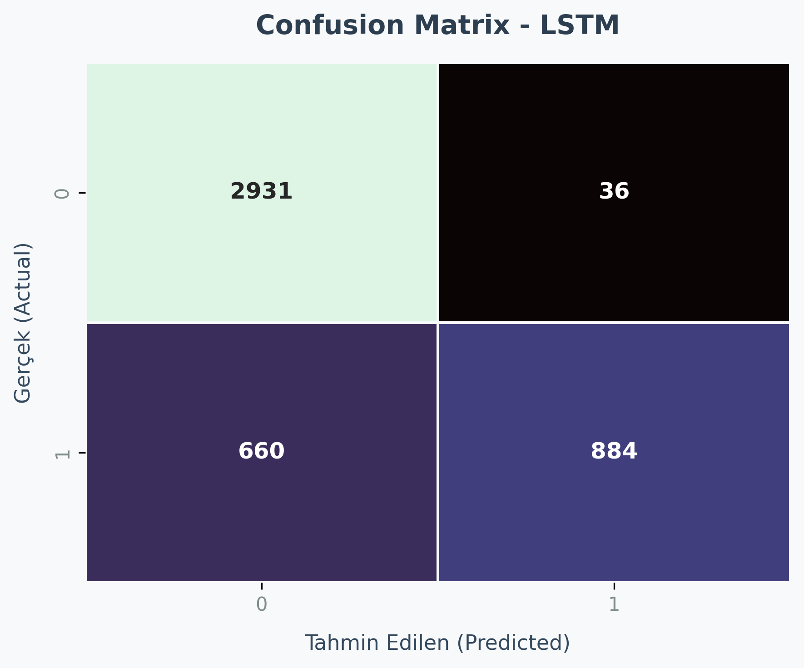
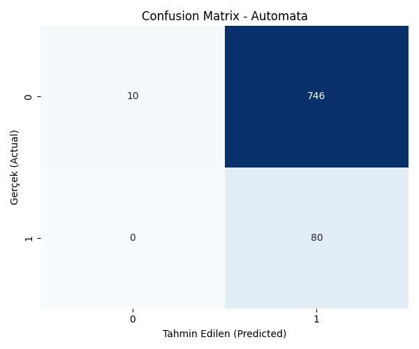
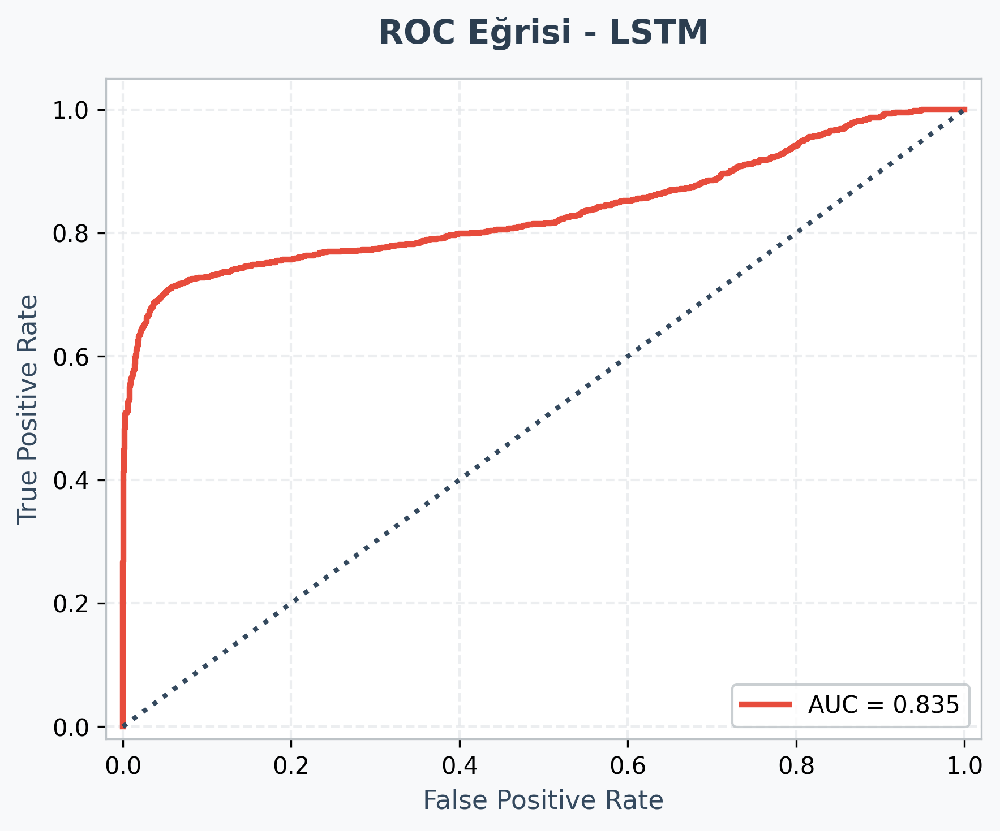
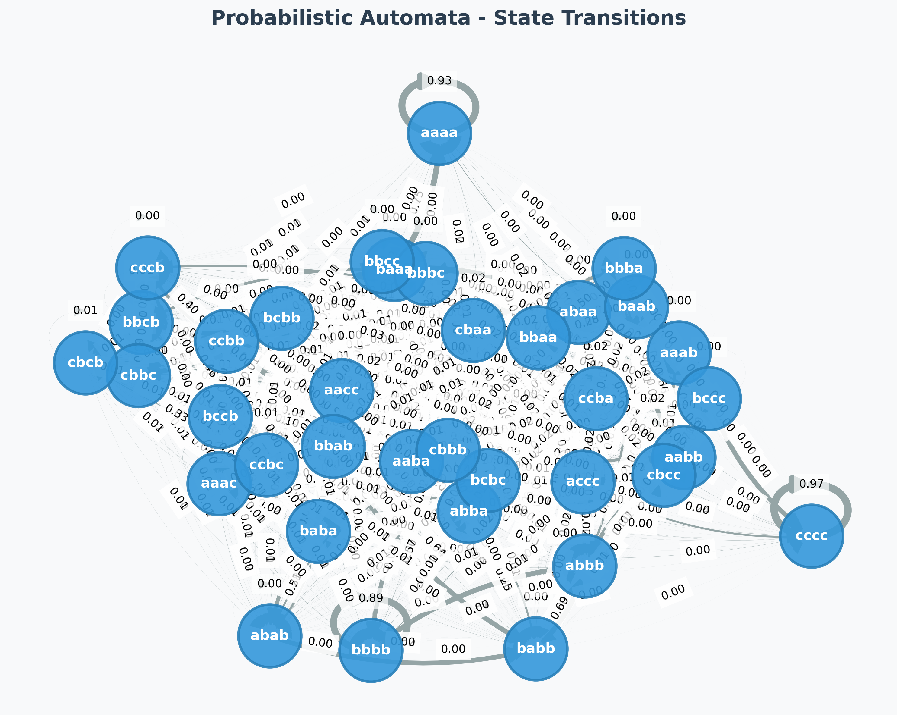
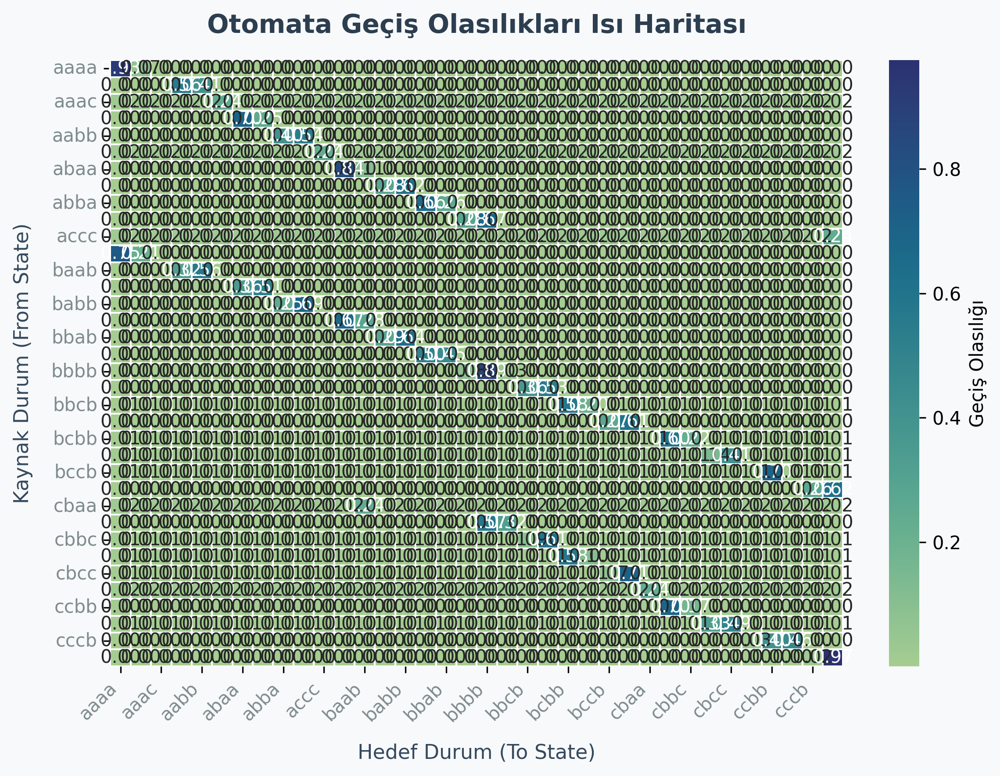

# From Black-Box to Explainability: Probabilistic Automata for Time Series Analysis

<div align="center">


</div>

---

## 📋 1. Proje Özeti ve Motivasyon

[cite_start]Bu proje, zaman serisi verileri üzerinde iki farklı modelleme paradigmasının (derin öğrenme tabanlı black-box modeller ve yorumlanabilir otomata tabanlı modeller) karşılaştırmalı analizini sunmaktadır[cite: 32, 33, 34]. [cite_start]Temel amaç tek bir en iyi modeli belirlemekten ziyade, modellerin farklı veri koşulları altındaki davranışlarını bilimsel ve sistematik bir şekilde analiz etmektir.

[cite_start]Deneyler, SKAB ve BATADAL veri setleri üzerinde anomali tespiti problemi olarak ele alınmıştır[cite: 44, 45, 46]. [cite_start]Her iki veri seti için de veri sızıntısını (data leakage) önleyecek standart deney protokolleri uygulanmış ve modellerin genellenebilirlik, gürültüye dayanıklılık ve açıklanabilirlik özellikleri değerlendirilmiştir[cite: 35, 120].

---

## 🔬 2. Araştırma Soruları

* [cite_start]Farklı modelleme yaklaşımları (LSTM, 1D-CNN, Olasılıksal Otomata) zaman serisi verilerinde nasıl bir performans göstermektedir? [cite: 38, 40, 69, 75]
* [cite_start]Modellerin performansı veri setine ne ölçüde bağımlıdır (Cross-Dataset Generalization)? [cite: 40]
* [cite_start]Modeller gürültü eklenmiş ve daha önce karşılaşılmamış (unseen) veri durumlarında nasıl davranmaktadır? [cite: 41]
* [cite_start]Olasılıksal otomata modelinin iç parametreleri (Window Size ve Alphabet Size) model performansını nasıl etkilemektedir? 

---

## 📊 3. Model Karşılaştırmaları ve Stabilite

[cite_start]Aşağıdaki tablo, modellerin iki farklı veri seti üzerindeki ortalama F1-skorlarını ve 5 farklı random seed (42, 123, 2026, 7, 999) ile elde edilen standart sapma değerlerini göstermektedir[cite: 7, 128, 151, 152]. [cite_start]Model eğitimi ve test süreçleri, SKAB için dosya bazlı GroupKFold ve BATADAL için zaman sıralı test kümeleri kullanılarak raporlanmıştır[cite: 147, 148, 153].

[cite_start]**Tablo 1: Model Performansı ve Stabilitesi (Ortalama F1-score ± Standart Sapma)** [cite: 8]

| Model | SKAB F1 | SKAB Accuracy | BATADAL F1 | BATADAL Accuracy |
| :--- | :---: | :---: | :---: | :---: |
| **LSTM** | 0.6954 ± 0.0628 | 0.6902 ± 0.0610 | 0.9022 ± 0.0207 | 0.8945 ± 0.0224 |
| **1D-CNN** | **0.7795 ± 0.0347** | 0.7761 ± 0.0378 | 0.7249 ± 0.0062 | 0.6647 ± 0.0095 |
| **Automata** | 0.5250 ± 0.0000 | 0.6417 ± 0.0000 | 0.8195 ± 0.0000 | 0.8161 ± 0.0000 |

> 📌 **Not:** Olasılıksal Otomata'nın deterministik yapısı gereği varyans gözlemlenmemiştir. BATADAL veri setinde uzun vadeli bağımlılıklar nedeniyle LSTM üstünlük sağlarken, kısa süreli anomaliler içeren SKAB veri setinde 1D-CNN en iyi performansı göstermiştir.

---

## 📈 4. Veri Setleri Arası Performans Farkları (Cross-Dataset)

[cite_start]Modellerin bir veri setinde eğitilip diğerlerinde test edilmesiyle elde edilen genellenebilirlik matrisi aşağıda sunulmaktadır[cite: 16]. 

[cite_start]**Tablo 2: Cross-Dataset Performans Karşılaştırması (seed=42)** [cite: 17]

| Eğitim → Test | Model | F1 Skor |
| :--- | :--- | :---: |
| SKAB → BATADAL | **Automata** | **0.5768** |
| SKAB → BATADAL | LSTM | 0.1123 |
| SKAB → BATADAL | 1D-CNN | 0.1289 |
| BATADAL → SKAB | **Automata** | **0.5164** |
| BATADAL → SKAB | LSTM | 0.1720 |
| BATADAL → SKAB | 1D-CNN | 0.1720 |

> [cite_start]🔍 **Yorum:** Olasılıksal Otomata, PAA ve SAX dönüşümleri üzerinden inşa edilen sembolik temsil sayesinde[cite: 76, 77], veri setine spesifik sayısal değerler yerine soyut örüntüleri öğrenmektedir. Bu durum, çapraz veri seti genellenebilirliğinde derin öğrenme modellerine kıyasla belirgin bir avantaj sağlamıştır.

---

## 🛡️ 5. Gürültü Etkisi ve Unseen Veri Davranışı

[cite_start]Modellerin veri kalitesindeki düşüşlere (Gaussian gürültü) ve test aşamasında daha önce gözlemlenmemiş örüntülere (unseen patterns) karşı direnci test edilmiştir[cite: 11, 80]. [cite_start]Otomata modelinde unseen durumlar için Levenshtein (Edit Distance) algoritması uygulanarak en yakın örüntüye eşleme mekanizması kullanılmıştır[cite: 81].

[cite_start]**Tablo 3: Gürültü Etkisi ve Unseen Senaryo Analizi** [cite: 12]

| Model | Dataset | Orijinal F1 | Gürültülü F1 | Unseen F1 | Δ Gürültü | Δ Unseen |
| :--- | :--- | :---: | :---: | :---: | :---: | :---: |
| LSTM | BATADAL | 0.9022 | 0.9031 | 0.8008 | +0.0009 | **-0.1014** |
| 1D-CNN | BATADAL | 0.7249 | 0.7268 | 0.6875 | +0.0019 | -0.0374 |
| **Automata** | **BATADAL** | **0.8195** | **0.8240** | **0.8126** | **+0.0045** | **-0.0070** |
| 1D-CNN | SKAB | 0.7795 | 0.7782 | 0.7665 | -0.0013 | -0.0130 |
| LSTM | SKAB | 0.6954 | 0.6949 | 0.7105 | -0.0005 | +0.0151 |
| **Automata** | **SKAB** | **0.5250** | **0.5247** | **0.5524** | **-0.0003** | **+0.0274** |

> 💡 **Bulgu:** Tüm modeller gürültü eklenmiş veriye karşı yüksek direnç göstermiştir. Ancak unseen veri senaryosunda derin öğrenme modelleri performans kaybı yaşarken, Otomata'nın Levenshtein tabanlı eşleme mekanizması modeli son derece stabil tutmuştur.

---

## ⚙️ 6. Parametre Etkileri ve Duyarlılık Analizi

[cite_start]İki aşamalı deney tasarımı ile Otomata modelinin iç parametrelerinin (Window Size ve Alphabet Size) performans üzerindeki etkileri analiz edilmiştir[cite: 20, 91]. [cite_start]Parametreler 3, 4, 5 ve 6 değerleri üzerinden test edilmiştir[cite: 96, 97].

[cite_start]**Tablo 4: Automata Parametre Duyarlılık Analizi - SKAB Veri Seti (F1-score)** [cite: 21]

| Alphabet \ Window Size | Değer = 3 | Değer = 4 | Değer = 5 | Değer = 6 |
| :---: | :---: | :---: | :---: | :---: |
| **Değer = 3** | 0.030 | 0.030 | 0.046 | 0.080 |
| **Değer = 4** | 0.051 | 0.098 | 0.149 | 0.231 |
| **Değer = 5** | 0.088 | 0.189 | 0.264 | 0.288 |
| **Değer = 6** | 0.133 | 0.259 | 0.323 | **0.333** |

> ✅ Parametre değişimlerinin performans üzerindeki analizi sonucunda SKAB veri seti için optimal konfigürasyon `window_size=6` ve `alphabet_size=6` olarak belirlenmiştir.

---

## 🖼️ 7. Değerlendirme Görselleri ve Olasılıksal Açıklanabilirlik

### 7.1 Confusion Matrix Karşılaştırması

[cite_start]Aşağıdaki karmaşıklık matrisleri, sınıflandırma performansının ve hata dağılımlarının görselleştirilmesini sağlamaktadır[cite: 229].

| LSTM Hata Dağılımı | Automata Hata Dağılımı |
|:---:|:---:|
|  |  |

### 7.2 ROC Eğrisi

[cite_start]Derin öğrenme modellerinden LSTM için oluşturulan ROC eğrisi aşağıda sunulmuştur[cite: 230].

| LSTM ROC Eğrisi |
|:---:|
|  |

### 7.3 Otomata State Diagram ve Geçiş Olasılıkları

[cite_start]Olasılıksal otomata modeli, durumlar arası geçiş olasılıklarını frekans tabanlı olarak öğrenir ve bu dizilerin olasılığını ardışık geçiş olasılıklarının çarpımı ile hesaplar[cite: 171, 174]. [cite_start]Düşük olasılığa sahip geçişler anomali adayı olarak işaretlenir[cite: 176].

[cite_start]Aşağıdaki görseller sistemin durum geçişlerini ve olasılık dağılımlarını temsil etmektedir[cite: 231, 232].

| Automata State Diagram | Transition Probability Heatmap |
|:---:|:---:|
|  |  |

### 7.4 Olasılıksal Karar Gerekçelendirmesi (XAI)

[cite_start]Modelin karar süreci, olasılıksal geçişler üzerinden matematiksel olarak gerekçelendirilerek JSON formatında raporlanmaktadır[cite: 156, 202]. [cite_start]Bu modül, mevcut durumu, gözlemlenen örüntüyü, uygulanan eşlemeyi ve nihai güven skorunu üretir[cite: 158, 159, 160, 162, 166, 169].

```json
{
  "time_step": 5,
  "state": "aab",
  "pattern": "adc",
  "status": "unseen",
  "mapped_to": "abc",
  "probability": 0.108,
  "decision": "anomaly"
}